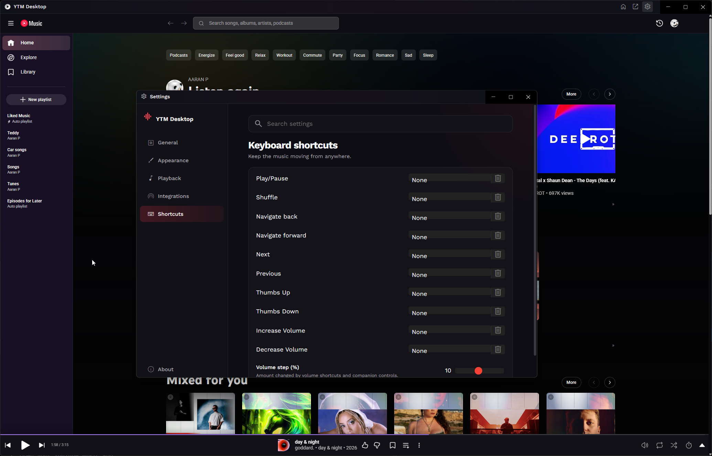
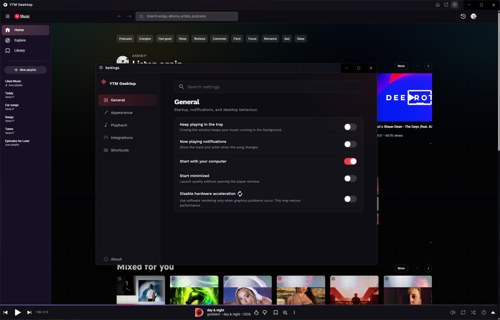

<p align="center">
  
</p>

<h1 align="center">YTM Desktop</h1>

<p align="center">
  A maintained, modern desktop client for YouTube Music.<br>
  Built for reliable playback, desktop integration, privacy, and extensibility.
</p>

<p align="center">
  <a href="https://github.com/Lostepic/ytmdesktop/releases/latest"></a>
  <a href="https://github.com/Lostepic/ytmdesktop/actions/workflows/build.yml"></a>
  <a href="https://github.com/Lostepic/ytmdesktop/releases"></a>
  
  <a href="LICENSE"></a>
</p>

## Screenshots

<p align="center">
  
</p>

| Now playing | Integrations and devices |
| --- | --- |
|  |  |

<details>
<summary>More settings screens</summary>

| Playback | Keyboard shortcuts |
| --- | --- |
|  |  |

| General | Authorized companions |
| --- | --- |
|  |  |

</details>

## Download

Download the current maintained version from [GitHub Releases](https://github.com/Lostepic/ytmdesktop/releases/latest). Every release is built for Windows, macOS, and Linux.

| Platform | Download | Installation |
| --- | --- | --- |
| Windows x64 | `YTM.Desktop-<version>.Setup.exe` | Run the Squirrel installer. Updates are delivered automatically from this repository. |
| macOS x64 | `YTM.Desktop-darwin-x64-<version>.zip` | Extract the archive and move YTM Desktop to Applications. The build is currently unsigned. |
| Debian/Ubuntu x64 | `youtube-music-desktop-app_<version>_amd64.deb` | Install with your graphical package manager or `sudo apt install ./<file>.deb`. |
| Fedora/RHEL x64 | `youtube-music-desktop-app-<version>-1.x86_64.rpm` | Install with your graphical package manager or `sudo dnf install ./<file>.rpm`. |

`RELEASES` and the `.nupkg` file are Windows automatic-update metadata, not manual installers.

The build badge reports validation of the maintained `development` branch. Version tags build all platforms in parallel and publish every package directly to the matching GitHub Release.

## What changed in 3.0

Version 3.0 is a substantial modernization of the inherited desktop client:

- Migrated the embedded player from deprecated `BrowserView` APIs to `WebContentsView`.
- Updated Electron, Vue, Vite, Fastify, Socket.IO, and build tooling.
- Reworked IPC validation, navigation boundaries, authorization, lifecycle cleanup, and crash recovery.
- Redesigned the application frame, loading experience, settings window, and injected YouTube Music styling.
- Added Midnight, OLED, Ocean, and Violet themes.
- Added settings search and an always-on-top compact mini-player.
- Kept Chromium's media pipeline unthrottled during background and minimized playback.
- Improved session restoration, playback timestamps, taskbar progress, global shortcuts, and volume controls.
- Added SponsorBlock sponsor/intro/outro controls.
- Added ListenBrainz scrobbling alongside Last.fm and Discord Rich Presence.
- Added OBS and Stream Deck friendly now-playing exports.
- Expanded the authenticated local companion API and Stream Deck support.
- Added permission-gated declarative plugin manifests without unrestricted Node.js execution.
- Added optional local-only playback and buffering telemetry.
- Added reproducible validation, packaging, Dependabot, and tag-based releases.

See the [changelog](docs/CHANGELOG.md) for the concise release history.

## Audio quality

YTM Desktop uses the highest source stream YouTube Music makes available to the signed-in account. YouTube Music Premium currently provides up to 256 kbps AAC/Opus; the original upload and connection quality can impose a lower ceiling.

The app keeps hardware acceleration enabled by default and prevents background renderer throttling. Speaker fill remains optional because channel processing changes the output rather than increasing source quality.

## Desktop integrations

### Stream Deck and companion API

Enable **Companion and plugin server** in Settings. The authenticated API listens locally on `127.0.0.1:9863`.

To connect the official Stream Deck plugin:

1. Open **Settings → Integrations** and enable **Pair a Stream Deck or companion**.
2. Select the YTMD Connector action in Stream Deck and press **Authorize**.
3. Approve the authorization prompt in YTM Desktop.

The pairing window closes automatically after five minutes. Existing authorizations remain encrypted locally and can be revoked from the authorized companions list.

### Now-playing export

Enable **Now-playing export** to write these local files:

```text
Documents/YTM Desktop/now-playing.json
Documents/YTM Desktop/now-playing.txt
```

They can be consumed by OBS text sources, Stream Deck actions, and local automation.

### SponsorBlock

SponsorBlock is disabled by default. It requests community skip segments only after being enabled. Sponsors can be skipped independently from optional intro and outro categories.

### ListenBrainz

ListenBrainz tokens are encrypted with the operating system's secure storage. Playing-now updates and completed listens are sent only while the integration is enabled.

### Plugins

Plugin manifests are read from the application data `plugins` directory. Only known declarative capabilities are accepted, and each requested capability must be approved individually in Settings. Arbitrary plugin JavaScript is not loaded into the Electron main process.

## Privacy and security

- Performance telemetry is disabled by default, stored locally, and never uploaded.
- Companion clients require explicit, expiring authorization and receive revocable tokens.
- Sign-in secrets are handled by the YouTube Music session rather than application code.
- ListenBrainz and companion tokens use OS-backed encryption when available.
- External navigation is restricted and renderer processes use sandboxing and context isolation.
- Electron fuses prevent Node execution and unsafe runtime flags in packaged builds.

## Updates

Packaged Windows builds resolve the exact latest tag from the fork's GitHub Releases API and then read Squirrel metadata from that version-specific release. Update ownership is fixed at `Lostepic/ytmdesktop` in both runtime and packaging configuration, so builds cannot accidentally follow the abandoned upstream repository or a stale update redirect.

The update feed is verified against each Windows release: it offers the newest version to older clients and reports no update to clients already current. macOS automatic updates require code signing, while Linux updates continue through installed packages or GitHub Releases.

## Development

### Requirements

- Node.js 22
- Corepack with Yarn 4.5.1
- Platform packaging tools when building installers

```bash
git clone https://github.com/Lostepic/ytmdesktop.git
cd ytmdesktop
corepack enable
yarn install --immutable
yarn start
```

### Validation

```bash
yarn check
yarn package
```

`yarn check` runs TypeScript validation, ESLint, and Prettier. `yarn package` creates the unpacked application for the current operating system.

### Installer creation

```bash
yarn make --arch x64
```

Build output is written to `out/make`. A pushed tag matching `v*` runs the multi-platform release workflow and publishes its artifacts.

## Repository layout

```text
src/main/                 Electron main process and integrations
src/renderer/             Vue windows and YouTube Music preload
src/shared/               Shared schemas and integration types
src/assets/               Runtime fonts and platform-specific icons
config/vite/              Main, renderer, and preload build targets
docs/                     Release history and supporting documentation
.github/workflows/        Validation and release automation
```

The icon variants in `src/assets/icons` are intentionally platform-specific: the Windows installer/tray resource, macOS bundle/template resources, Linux light/dark tray resources, title-bar artwork, and Windows media controls.

## License and project history

YTM Desktop is distributed under GPL-3.0 and incorporates work from the original YouTube Music Desktop App maintainers and contributors. Required copyright and licence notices are retained.

This project is not affiliated with Google or YouTube. YouTube Music is a trademark of Google LLC.
